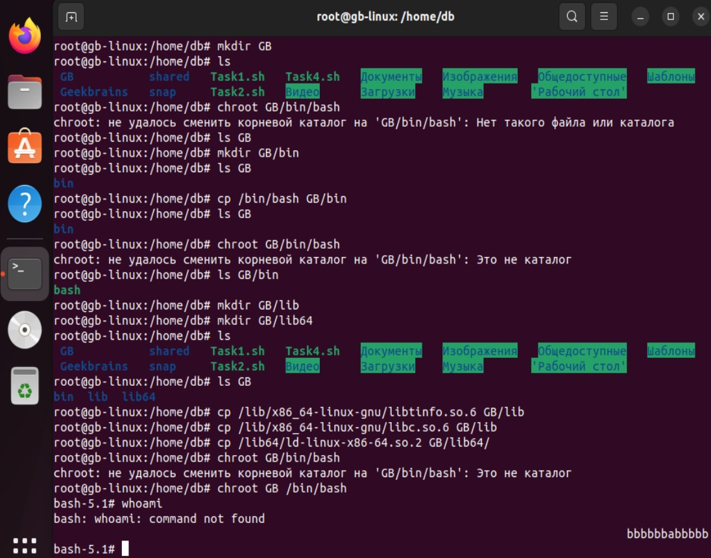
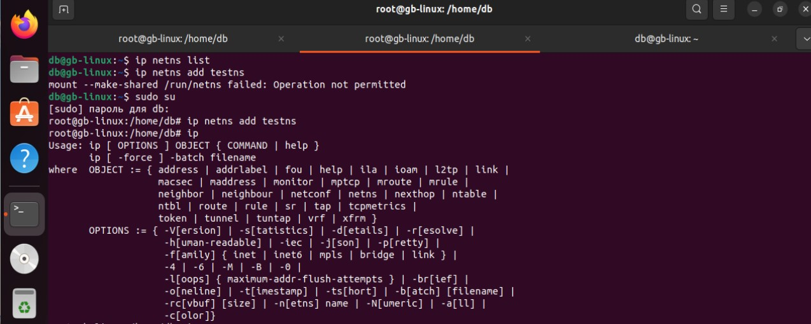
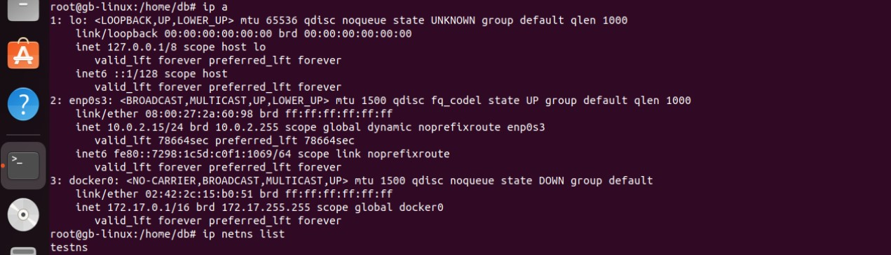
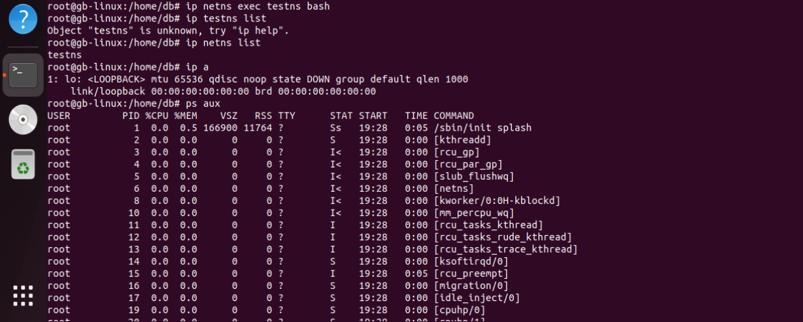
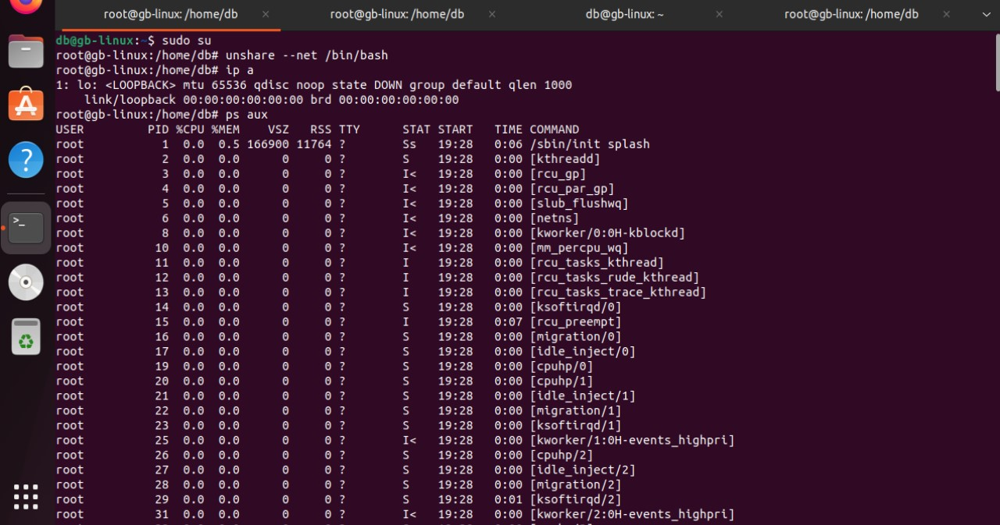
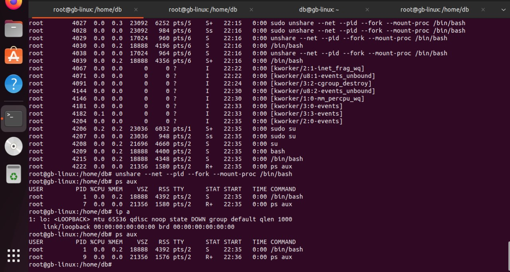

 ***Механизмы пространства имен***

Задание: необходимо продемонстрировать изоляцию одного и того же приложения (как решено на семинаре - командного интерпретатора) в различных пространствах имен.

Формат сдачи ДЗ: предоставить доказательства выполнения задания посредством ссылки на google-документ с правами на комментирование/редактирование.
Результатом работы будет: текст объяснения, логи выполнения, история команд и скриншоты (важно придерживаться такой последовательности).

**Пример 1**

Все дейсвия выполнял с правами root

1. Создаем директориb "GB" и "bin":

mkdir GB
mkdir GB/bin

2. Копируем исполняемый файл командного интерпретатора /bin/bash в папку "GB/bin":

cp /bin/bash GB/bin

3. Создаем необходимые директории "GB/lib" и "GB/lib64":

mkdir GB/lib
mkdir GB/lib64

4. Копируем необходимые библиотеки в папку "GB/lib" и "GB/lib64":

cp /lib/x86_64-linux-gnu/libtinfo.so.6 GB/lib
cp /lib/x86_64-linux-gnu/libc.so.6 GB/lib
cp /lib64/ld-linux-x86-64.so.2 GB/lib64/

5. Запускаем команду chroot для изменения корневой папки:

chroot GB /bin/bash

**Пример 2**

**Сетевое пространство имен**

1. Создаем пространсво

ip netns list
ip netns add testns

2. Создаем пространство имен в ней

ip netns list — посмотрели
testns — увидели и еще ничего не подключенно

3. Подключи к нашему свичу testns такой процес

ip netns exec testns bash

4. Проверяем 

ip a

5. Вывели ввели ps aux и весь набор процессов

ps aux

**Пример 3**

unshare —-net /bin/bash

ip a

мы сейчас в пространсве имен, который ограничен только по сетевому пространству

ps aux

мы ввели ps aux и весь набор процессов

теперь выйдем от сюда,и ограничим дополнительно

unshare --net --pid --fork --mount-proc /bin/bash

ps aux

unshare Утилита которая позволяет это разграничивать -

--net — ограничевает сетевое пространство имен

ip a

-mount-proc — разграничивает процессы

ps aux

--fork — изолирует память

--pid — изолирует дерево процессов

Формально мы внутри контейнера

ls

ls /

ps aux

