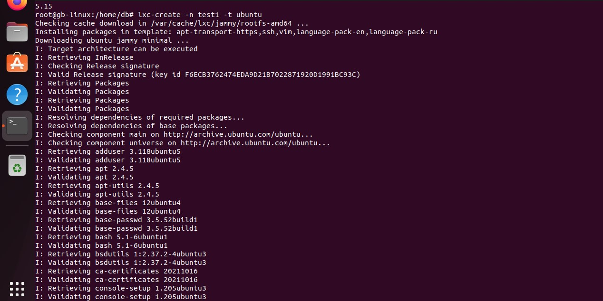
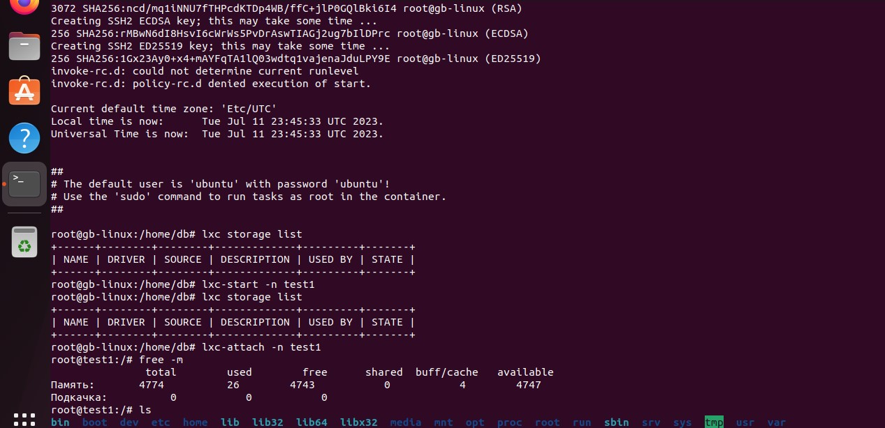
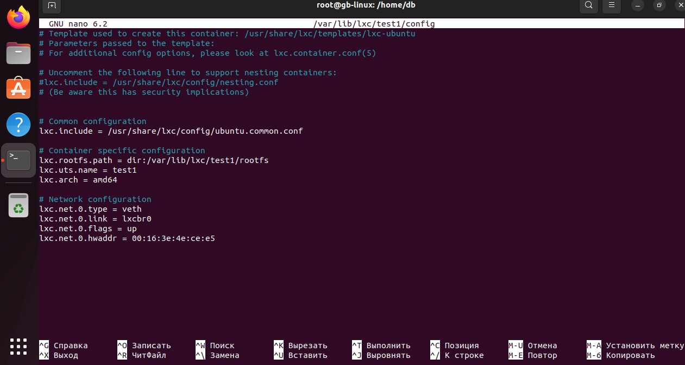
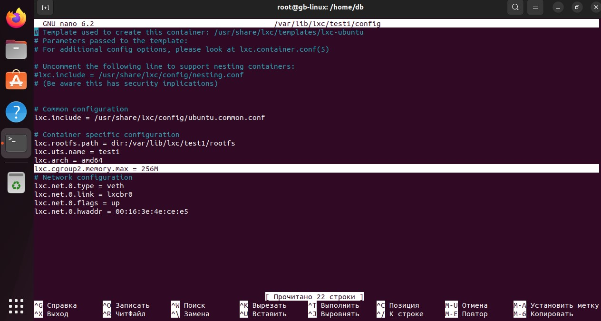
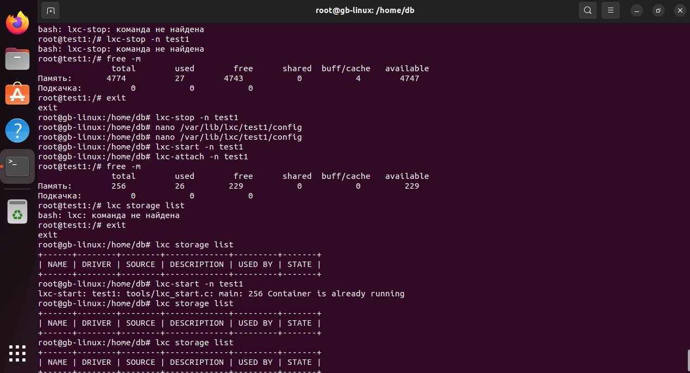

***Механизмы контрольных групп***

1. Запустить контейнер с ubuntu, используя механизм LXC
2. Ограничить контейнер 256 Мб ОЗУ и проверить, что ограничение работает

Задание по желанию ..

4. Добавить автозапуск контейнеру, перезагрузить ОС и убедиться, что контейнер действительно запустился самостоятельно
5. ''при создании указать файл, куда записывать логи
6. ''после перезагрузки проанализировать логи

**Задание 1. Запустить контейнер с ubuntu, используя механизм LXC**

Создаем контейнер "test1":

lxc-create -n test1 -t ubuntu

Контейнер успешно создан, на экране показано сообщение

Запускаем контейнер

lxc-stast -n test1

Заходим в наш контейнер

lxc-attach -n test1

Командой free -m проверяем количество памяти

**Задание 2. Ограничить контейнер 256 Мб ОЗУ и проверить, что ограничение работает**

Заходим в редактор nano и видим, что ограничений по памяти нет

Добавляем в раздел "Conteiner specific configuration" ограничение по пямяти

lxc.cgroup2.memory.max = 256M

Проверяем, что ограничение работает

free -m

