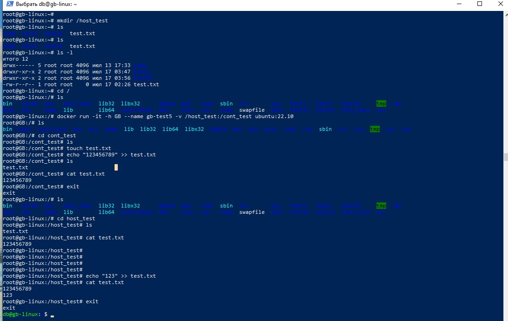

***Введение в Docker***

Задание:
1. Запустить контейнер с БД, отличной от mariaDB, используя инструкции на сайте: https://hub.docker.com/

По желанию - 

3. Заполнить БД данными через консоль
4. Запустить phpmyadmin (в контейнере) и через веб проверить, что все введенные данные доступны

Задание

Создать папку, которую мы будем готовы смонтировать в контейнер

В этой папке создать файл test.txt и наполнить данными

В домашней директории создать файл test.txt, который также необходимо будет смонтировать в контейнер и наполнить совершенно другими данными

Создать контейнер из образа ubuntu:22.10

Задать ему имя

Задать hostname

Смонтировать созданную ранее папку с хоста в контейнер

Смонтировать созданный ранее текстовый файл внутрь смонтированной папки, чтобы он пересекался с созданным ранее файлом в этой папке. Просмотреть этот файл.

Формат сдачи ДЗ: предоставить доказательства выполнения задания посредством ссылки на google-документ с правами на комментирование/редактирование.
Результатом работы будет: текст объяснения, логи выполнения, история команд и скриншоты (важно придерживаться такой последовательности).
В названии работы должны быть указаны ФИ, номер группы и номер урока.

1. Создаем паку 

mkdir /host_test

2. Создаем контейнер и подвязываем нашу папку host_test с папкой cont_test, которая создаться при запуске контейнера

docker run -it -h GB --name gb-test5 -v /host_test:/cont_test ubuntu:22.10

3. Заходим в папку cont_test в нащ=шем контейненер и создаем файл test.txt и меняем в нем содиржимое

touch test.txt

echo "123456789" >> test.txt

4. Выходим из контейнера exit

5. Проверяем наш файл в папке host_test

cd host_test

cat test.txt

