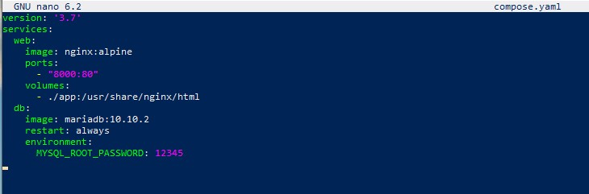
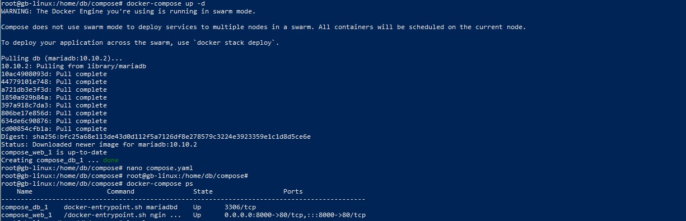

***Docker Compose и Docker Swarm***
 
1. Создать сервис, состоящий из 2 различных контейнеров: 1 - веб, 2 - БД (compose)

** не обязательно 

2. Необходимо создать 3 сервиса в каждом окружении (dev,  lab)

** не обязательно 

3. По итогу на каждой ноде должно быть по 2 работающих контейнера
4. Выводы зафиксировать

---

1. Создаем директорию "compose" и переходим в неё:

*mkdir compose*

*cd compose*

2. В данной директории создаем файл "compose.yaml" и меняем его содиржимое: 

*nano compose.yaml*

3. Создаем сервис из 2-х контейнеров (web и db)

4. Запуск Docker Compose:  

*docker-compose up -d*

Проверяем активность контейнера

docker-compose ps

